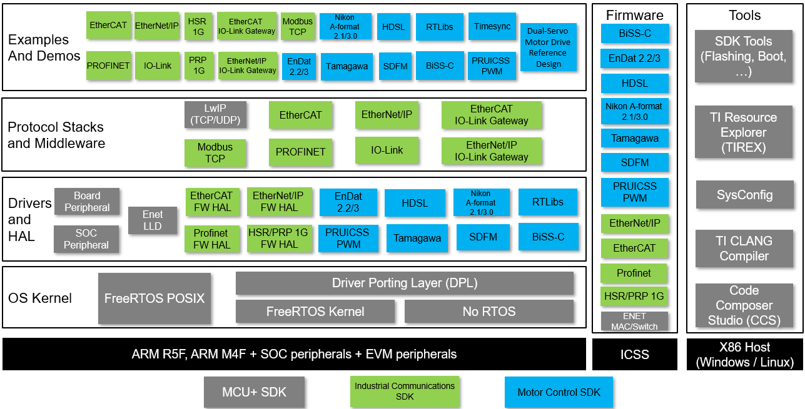
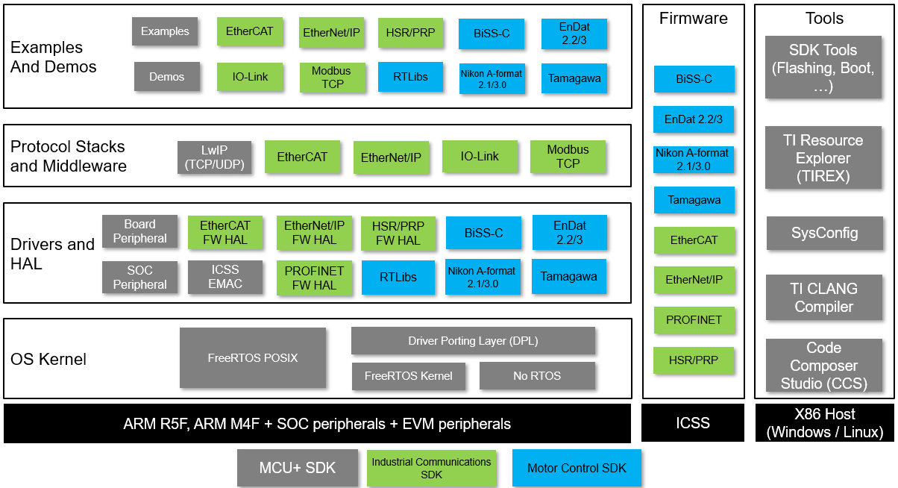
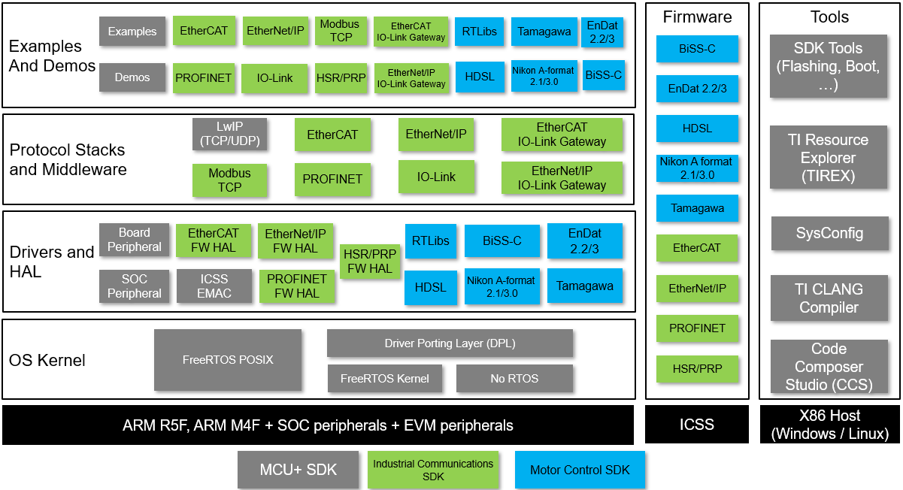

<div align="center">

<br/>

# Motor Control SDK

[Introduction](#introduction) | [Features](#features) | [Overview](#overview) | [Learn](#learn) | [Usage](#usage) | [Contribute](#contributing-to-the-project)

</div>

## Introduction

Motor Control SDK enables real-time communication for position and current sense from motors, and real-time control libraries for ARM R5F CPU and related peripherals for TI processors.

Real-time communication with encoders and current sensing is typically handled by the Programmable Real-Time Unit Industrial Communication Subsystem (PRU-ICSS). The PRU-ICSS is a co-processor subsystem containing Programmable Real-Time (PRU) cores which implement the low level firmware. The PRU-ICSS frees up the main ARM cores in the device for other functions, such as control and data processing.

The devices supported by Motor Control SDK currently include

- [AM2434](https://www.ti.com/product/AM2434), [AM2432](https://www.ti.com/product/AM2432), [AM2431](https://www.ti.com/product/AM2431)
- [AM263P4](https://www.ti.com/product/AM263P4), [AM263P2](https://www.ti.com/product/AM263P2), [AM263P4-Q1](https://www.ti.com/product/AM263P4-Q1), [AM263P2-Q1](https://www.ti.com/product/AM263P2-Q1)
- [AM2612](https://www.ti.com/product/AM2612), [AM2612-Q1](https://www.ti.com/product/AM2612-Q1)

## Features

- Out of Box Application Examples
  - Position Sense Encoders
  - Current Sense (SDFM)
  - Real Time Libraries
  - PRU-ICSS PWM
  - Timesync
  - Reference Design

- Firmware
  - Firmware for Position Sense Encoders
  - Firmware for Current Sense (SDFM)

- Dependent SDKs
  - MCU+ SDK
  - Industrial Communications SDK

## Overview

### Software Block Diagram for AM243x



### Software Block Diagram for AM263Px



### Software Block Diagram for AM261x




Motor Control SDK source comprises of multiple repositories with the current
repository at it's core. To build the SDK successfully, there are other
repositories that need to be cloned and are listed below:

- [MCU+ SDK](https://github.com/TexasInstruments/mcupsdk-core)
  - MCU+ SDK needs multiple other repositories listed in [Overview section of MCU+ SDK README](https://github.com/TexasInstruments/mcupsdk-core/blob/next/README.md#overview)
- [Industrial Communications SDK](https://github.com/TexasInstruments/ind-comms-sdk)

Prebuilt SDK installers for specific devices are available at below links. Please note that installers are packaged specific to each device to reduce size.

- [AM243x Motor Control SDK](https://www.ti.com/tool/download/MOTOR-CONTROL-SDK-AM243X)
- [AM263Px Motor Control SDK](https://www.ti.com/tool/download/MOTOR-CONTROL-SDK-AM263PX)
- [AM261x Motor Control SDK](https://www.ti.com/tool/download/MOTOR-CONTROL-SDK-AM261X)

## Learn

TI has an amazing collection of tutorials on MCU+ Academy to help you get started.

- [AM24x MCU+ Academy](https://dev.ti.com/tirex/explore/node?isTheia=false&node=A__AEIJm0rwIeU.2P1OBWwlaA__AM24X-ACADEMY__ZPSnq-h__LATEST)
- [AM26x MCU+ Academy](https://dev.ti.com/tirex/explore/node?isTheia=false&node=A__AEIJm0rwIeU.2P1OBWwlaA__AM26X-ACADEMY__t0CaxbG__LATEST)

## Usage

### Prerequisites

#### Supported HOST environments

- Windows 10 64bit
- Ubuntu 18.04 64bit
- Mac OS 14.6 64bit

Note that these are the versions on which SDK has been validated. Higher versions may also work.

### Clone and build from GIT

#### Cloning The Repositories

To clone the repositories, do below in your workarea folder:

1. Clone the Motor Control SDK repository

```bash
git clone https://github.com/TexasInstruments/motor-control-sdk.git motor_control_sdk
```

2. Clone the Industrial Communications SDK repository and update the "IND_COMMS_SDK_PATH" variable in imports.mak file.

```bash
git clone https://github.com/TexasInstruments/ind-comms-sdk.git ind_comms_sdk
```

3. Clone the MCU+ SDK repository and dependent repositories as per instructions listed in [MCU+ SDK README](https://github.com/TexasInstruments/mcupsdk-core/blob/next/README.md#clone-and-build-from-git). Update the "MCU_PLUS_SDK_PATH" variable in imports.mak file.

This should clone all the repositories required for Motor Control SDK development. Now proceed to [Download and Install dependencies](#downloading-and-installing-dependencies) section.

#### Downloading And Installing Dependencies

To download and install dependencies, follow the below steps mentioned in [MCU+ SDK README](https://github.com/TexasInstruments/mcupsdk-core/blob/next/README.md#downloading-and-installing-dependencies)

### Building the SDK

#### Basic Building With Makefiles

---

**NOTE**

- Use `gmake` in windows, add path to gmake present in CCS at `C:\ti\ccsxxxx\ccs\utils\bin` to your windows PATH. We have
  used `make` in below instructions.
- Unless mentioned otherwise, all below commands are invoked from root folder of the "motor_control_sdk"  repository.
- Current supported device names are am243x, am263px and am261x
- Pass one of these values to `"DEVICE="`
- You can also build components (examples, tests or libraries) in `release` or `debug`
  profiles. To do this pass one of these values to `"PROFILE="`

---

1. Run the following command to create makefiles, this step is optional since this is invoked as part of other steps as well,

   ```bash
   make gen-buildfiles DEVICE=am243x
   ```

2. To see all granular build options, run

   ```bash
   make -s help DEVICE=am243x
   ```
   This should show you commands to build specific libraries, examples or tests.

3. Make sure to build the required libraries in motor_control_sdk, ind_comms_sdk and mcu_plus_sdk
   before attempting to build an example. For example, to build a Tamagawa Diagnostic (single channel)
   example for AM243x, run the following:
   ```bash
   # cd to folder containing mcu_plus_sdk
   make -s -j4 libs DEVICE=am243x PROFILE=debug
   # cd to folder containing ind_comms_sdk
   make -s -j4 libs DEVICE=am243x PROFILE=debug
   # cd to folder containing motor_control_sdk
   make -s -j4 libs DEVICE=am243x PROFILE=debug
   ```
   Once the library build is complete, to build the example run:
   ```bash
   make -s -C examples/position_sense/tamagawa_diagnostic/single_channel/am243x-evm/r5fss0-0_freertos/ti-arm-clang all PROFILE=debug
   ```

4. Following are the commands to build **all libraries** and **all examples**. Valid PROFILE's are "release" or "debug"

   ```bash
   # cd to folder containing mcu_plus_sdk
   make -s -j4 clean DEVICE=am243x PROFILE=debug
   make -s -j4 all   DEVICE=am243x PROFILE=debug
   # cd to folder containing ind_comms_sdk
   make -s -j4 clean DEVICE=am243x PROFILE=debug
   make -s -j4 all   DEVICE=am243x PROFILE=debug
   # cd to folder containing motor_control_sdk
   make -s -j4 clean DEVICE=am243x PROFILE=debug
   make -s -j4 all   DEVICE=am243x PROFILE=debug
   ```

### More information on SDK usage

For more details on SDK usage, please refer to the SDK userguide.

Note that userguides are specific to a particular device. The links for all the supported devices are given below.
- [AM243x User Guide](https://software-dl.ti.com/processor-industrial-sw/esd/motor_control_sdk/am243x/latest/docs/api_guide_am243x/index.html)
- [AM263Px User Guide](https://software-dl.ti.com/processor-industrial-sw/esd/motor_control_sdk/am263px/latest/docs/api_guide_am263px/index.html)
- [AM261x User Guide](https://software-dl.ti.com/processor-industrial-sw/esd/motor_control_sdk/am261x/latest/docs/api_guide_am261x/index.html)

The documentation can also be generated as mentioned in the below section.

### Generate Documentation

- Goto motor_control_sdk and type below to build the documentation for the device of interest

  ```bash
  make docs DEVICE=am243x
  ```

- Browse API guide by opening below file for a DEVICE of interest

  ```bash
  README_FIRST_*.html
  ```

## Contributing to the project

This project is currently not accepting any contributions.

Please wait for a further update on accepting external contributions. For support, navigate to https://e2e.ti.com.